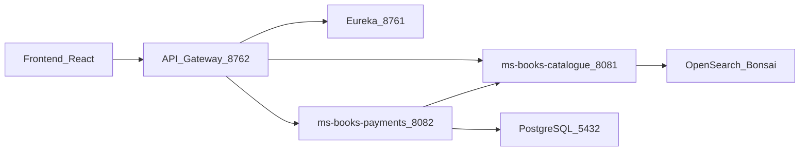

# Relatos de Papel

Librería online fullstack con catálogo de libros, carrito de compra, checkout y procesamiento de pagos.

Proyecto desarrollado en el marco del **Máster en Desarrollo Full Stack** (Actividad 3). El sistema integra una aplicación web en React con una arquitectura de microservicios en Spring Boot, orientada a demostrar patrones de service discovery, API Gateway y comunicación entre servicios en un entorno distribuido.

---

## Características principales

| Área | Capacidades |
|------|-------------|
| **Frontend** | Catálogo de libros, búsqueda con sugerencias, filtros por facets, detalle de producto, carrito persistente (Zustand), checkout y confirmación de pedido |
| **Backend** | Microservicios desacoplados para catálogo (OpenSearch) y pagos (PostgreSQL), con validación de stock entre servicios |
| **Infraestructura** | Eureka para descubrimiento de servicios, API Gateway con patrón POST tunneling y orquestación completa mediante Docker Compose |

---

## Arquitectura del sistema

El frontend y cualquier cliente externo acceden al backend exclusivamente a través del **API Gateway** (puerto `8762`). Los microservicios se registran en **Eureka** y se descubren dinámicamente sin direcciones IP fijas.



### Patrón Gateway tunneling

El gateway expone un único contrato HTTP hacia el exterior: todas las peticiones entrantes deben ser `POST`. El método HTTP real y los parámetros de la operación se envían en el cuerpo de la petición mediante la estructura `GatewayRequest`:

```json
{
  "targetMethod": "GET",
  "queryParams": { "visible": ["true"] },
  "body": null
}
```

El frontend implementa este contrato en [`relatos-de-papel-frontend/src/api/gatewayClient.js`](relatos-de-papel-frontend/src/api/gatewayClient.js). Las peticiones directas con `GET`, `PUT` o `DELETE` al gateway devuelven `405 Method Not Allowed`.

---

## Stack tecnológico

| Capa | Tecnologías |
|------|-------------|
| **Frontend** | React 19, Vite 7, Tailwind CSS 4, React Router 7, Zustand |
| **Backend** | Java 25, Spring Boot 4.0.2, Spring Cloud 2025.1.0 (Gateway, Eureka) |
| **Datos** | OpenSearch / Bonsai (catálogo), PostgreSQL 17 (pagos) |
| **DevOps** | Docker, Docker Compose, Nginx (imagen de producción del frontend), despliegue preparado para Vercel |

---

## Estructura del repositorio

```
Actividad-3/
├── docker-compose.yml              # Stack completo (recomendado)
├── relatos-de-papel-frontend/      # SPA React
├── relatos-de-papel-backend/       # Microservicios Spring
│   ├── eureka-server/
│   ├── gateway/
│   ├── ms-books-catalogue/
│   └── ms-books-payments/
├── docker/frontend/                # Dockerfile y configuración Nginx
└── docs/                           # Guías operativas y colección Postman
```

---

## Requisitos previos

- [Docker Desktop](https://www.docker.com/products/docker-desktop/) instalado y en ejecución
- Node.js 20 o superior (solo si se ejecuta el frontend fuera de Docker)
- Credenciales de OpenSearch (Bonsai) para el microservicio de catálogo
- Puertos libres en el host: `5173`, `5432`, `8081`, `8082`, `8761`, `8762`

---

## Inicio rápido

Desde la raíz del repositorio:

```bash
cp .env.example .env
cp relatos-de-papel-backend/.env.example relatos-de-papel-backend/.env
```

Edita ambos archivos `.env` con tus credenciales reales de OpenSearch. El valor de `VITE_API_BASE_URL` debe apuntar al gateway **desde el navegador del host**, normalmente `http://localhost:8762`.

Arranca el stack completo:

```bash
docker compose up --build
```

### URLs de acceso

| Servicio | URL |
|----------|-----|
| Frontend | http://localhost:5173 |
| API Gateway | http://localhost:8762 |
| Eureka Dashboard | http://localhost:8761 |

Para detener los contenedores:

```bash
docker compose down
```

Para reiniciar con base de datos limpia:

```bash
docker compose down -v
```

---

## Desarrollo local

### Solo backend

Desde `relatos-de-papel-backend/`:

```bash
docker compose -f docker-compose.backend-local.yml up --build
```

### Frontend en modo desarrollo

Con el backend ya en ejecución, desde `relatos-de-papel-frontend/`:

```bash
cp .env.example .env
npm install
npm run dev
```

La aplicación estará disponible en la URL que indique Vite (normalmente `http://localhost:5173`).

Para instrucciones detalladas, verificación del gateway, logs y resolución de incidencias, consulta la [guía de levantamiento local](docs/guia-levantamiento-local.md).

---

## Variables de entorno

| Variable | Ubicación | Descripción |
|----------|-----------|-------------|
| `OPENSEARCH_URL` | `relatos-de-papel-backend/.env` | URL del cluster OpenSearch |
| `OPENSEARCH_USERNAME` | `relatos-de-papel-backend/.env` | Usuario del cluster |
| `OPENSEARCH_PASSWORD` | `relatos-de-papel-backend/.env` | Contraseña del cluster |
| `OPENSEARCH_INDEX` | `relatos-de-papel-backend/.env` | Nombre del índice (por defecto: `relatos`) |
| `VITE_API_BASE_URL` | `.env` (raíz) o `relatos-de-papel-frontend/.env` | URL del gateway accesible desde el navegador |

Plantillas de referencia: [`.env.example`](.env.example), [`relatos-de-papel-backend/.env.example`](relatos-de-papel-backend/.env.example) y [`relatos-de-papel-frontend/.env.example`](relatos-de-papel-frontend/.env.example).

Los archivos `.env` están excluidos del control de versiones para evitar la exposición de credenciales.

---

## Flujo funcional

1. Pantalla de bienvenida (landing) con redirección automática al catálogo.
2. Listado de libros cargados desde la API en tiempo real.
3. Búsqueda por título con sugerencias y filtrado por categorías mediante facets.
4. Consulta del detalle de un libro y adición al carrito.
5. Revisión del carrito y proceso de checkout.
6. Confirmación del pedido con referencia del pago generado.

---

## API y pruebas

El gateway centraliza el acceso a dos microservicios:

- **ms-books-catalogue** — CRUD de libros, búsqueda avanzada, disponibilidad y gestión de stock (`/api/books`)
- **ms-books-payments** — Creación y consulta de pagos, con actualización automática de stock (`/api/payments`)

La referencia completa de endpoints, códigos de respuesta y ejemplos de peticiones está documentada en el [README del backend](relatos-de-papel-backend/README.md).

Para pruebas manuales, importa la colección Postman incluida en el repositorio:

[`docs/postman/Relatos-Backend-Gateway.postman_collection.json`](docs/postman/Relatos-Backend-Gateway.postman_collection.json)

---

## Documentación adicional

| Recurso | Descripción |
|---------|-------------|
| [Guía de levantamiento local](docs/guia-levantamiento-local.md) | Configuración paso a paso, verificación POST-only del gateway y troubleshooting |
| [README del backend](relatos-de-papel-backend/README.md) | Arquitectura de microservicios, contrato API y ejemplos con Gateway tunneling |

---

## Licencia

Proyecto académico desarrollado con fines formativos. No se distribuye bajo una licencia de software abierto.
